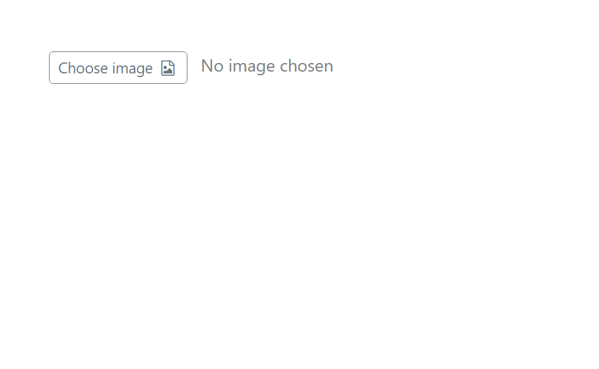
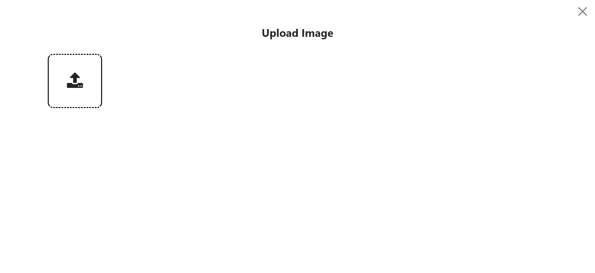
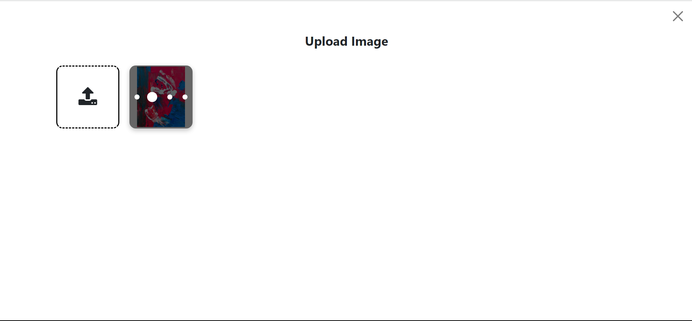
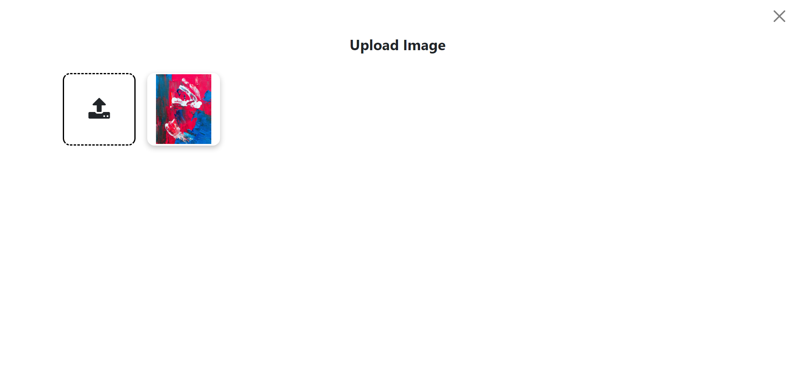
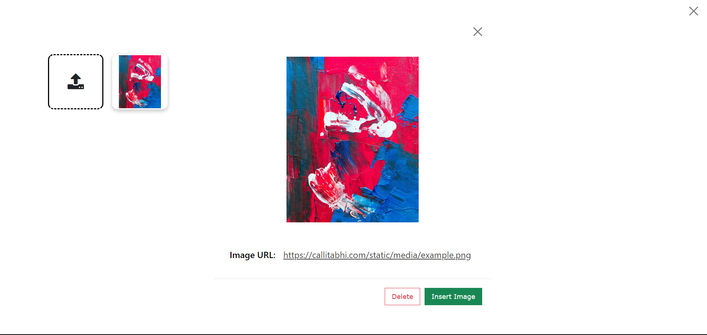

# EasyImageUpload Module Documentation

The EasyImageUpload Module is a light-weight JavaScript module designed to handle image uploads, previews, editing, and deletion in a web application. It provides a simple and easy-to-use interface to allow users to upload and manage images effectively.


## Table of Contents
- [Getting Started](#getting-started)
  - [Prerequisites](#prerequisites)
  - [Installation](#installation)
  - [Usage](#usage)
- [API Documentation](#api-documentation)
  - [Methods](#methods)
    - `openUploadImageModal`
    - `imageEdit`
    - `setDeleteImageAPIURL`
    - `setPostImageAPIURL`
    - `setDeleteImageHeaders`
    - `setPostImageHeaders`

## Getting Started 

### Prerequisites

Before using the EasyImageUpload, ensure you have the following prerequisites:

- A working web application project.
- Access to a server with endpoints to handle image uploads and deletions.

### Installation

1. Include the required CSS and JavaScript files in your HTML:

```html
    <link rel="stylesheet" href="https://cdn.jsdelivr.net/npm/bootstrap@5.2.3/dist/css/bootstrap.min.css">
    <link rel="stylesheet" href="https://cdnjs.cloudflare.com/ajax/libs/font-awesome/4.7.0/css/font-awesome.min.css">
    <link rel="stylesheet" href="easy-image-upload.css">

    <script src="https://cdn.jsdelivr.net/npm/@popperjs/core@2.11.6/dist/umd/popper.min.js"
        integrity="sha384-oBqDVmMz9ATKxIep9tiCxS/Z9fNfEXiDAYTujMAeBAsjFuCZSmKbSSUnQlmh/jp3"
        crossorigin="anonymous"></script>
    <script src="https://cdn.jsdelivr.net/npm/bootstrap@5.2.3/dist/js/bootstrap.min.js"
        integrity="sha384-cuYeSxntonz0PPNlHhBs68uyIAVpIIOZZ5JqeqvYYIcEL727kskC66kF92t6Xl2V"
        crossorigin="anonymous"></script>
    <script src="easy-image-upload.css.js"></script>
```

2. Ensure your web application has a div container element for the image upload modal:

```html
<!-- Image Upload Modal -->
<div class="modal fade" id="imageUploadModal" data-bs-backdrop="static" data-bs-keyboard="false" tabindex="-1"
    aria-labelledby="imageModalTitle" aria-hidden="true">
    <!-- Modal content goes here -->
</div>

```

3. Define a button to trigger the image upload modal:

```html
<!-- Button to open Modal -->
<div class="mx-5 my-5">

    <button type="button" class="btn btn-outline-secondary btn-sm" onclick="EasyImageUpload.openUploadImageModal(this)">
        Choose image    
        <i class="fa fa-file-image-o mx-1" aria-hidden="true"></i>
    </button>
    <span class="es-im-up-status mx-2" style="color:gray;">
        No image chosen
    </span>
</div>
```
4. Create a div container element for the image selection modal:
```html
<!-- Select Image Modal -->
<div class="modal fade" id="imageSeclectModal" data-bs-backdrop="static" data-bs-keyboard="false" tabindex="-1"
    aria-hidden="true">
    <!-- Modal content goes here -->
</div>

```

5. Include the toast container for status messages:

```html
<!-- toast -->
<div class="toast-container position-fixed bottom-0 end-0 p-3">
    <div id="liveToast" class="toast" role="alert" aria-live="assertive" aria-atomic="true">
        <div class="toast-header">
            <strong class="me-auto">Status</strong>
            <button type="button" class="btn-close" data-bs-dismiss="toast" aria-label="Close"></button>
        </div>
        <div class="toast-body strong">
            <!-- Toast message goes here -->
        </div>
    </div>
</div>
```

## Usage
To use the EasyImageUpload Module in your web application, follow these steps:

1. Configure the EasyImageUpload with your server's API URLs and headers. This should be done before any other operations. For example:
```html
<script>
    // Set your server's API URLs
    const postMediaUrl = 'https://your-server.com/upload'; // URL to handle image upload
    const delMediaUrl = 'https://your-server.com/delete'; // URL to handle image deletion

    // Configure EasyImageUpload
    EasyImageUpload.setPostImageAPIURL(postMediaUrl);
    EasyImageUpload.setDeleteImageAPIURL(delMediaUrl);


    // Set custom headers for API requests
    EasyImageUpload.setPostImageHeaders({
        'Content-Type': 'application/json',
        'img-data': img-data,
        'CSRF-Token': csrf_token
    });

    EasyImageUpload.setDeleteImageHeaders({
        'Content-Type': 'application/json',
        'image-id': imageId,
        'CSRF-Token': csrf_token            
    });


</script>

```
The EasyImageUpload automatically handles image uploading and deletion. When the user clicks the "Add Image" button, the image upload modal will appear, and the user can select an image to upload. Uploaded images will be displayed as thumbnails. Users can also click on an uploaded image to view and manage the image details.

2. The status of image uploading and deletion is displayed using a toast message at the bottom-right corner of the screen.
3. You can access the selected image URL by attaching the `data-sel-img-url` attribute to the button that opens the image upload modal. The selected image URL will be set to this attribute when the user selects an uploaded image. For example:
```html
<!-- Button to open Modal with image URL attribute -->
<button type="button" class="btn btn-outline-secondary btn-sm" onclick="EasyImageUpload.openUploadImageModal(this"
data-sel-img-url="">
    Choose image    
    <i class="fa fa-file-image-o mx-1" aria-hidden="true"></i>
</button>
```
To programmatically handle image selection and deletion, you can use the following JavaScript functions:
- `openUploadImageModal`: Opens the image upload modal when called. This function is triggered when the "Add Image" button is clicked.
- `imageEdit`: Opens the image selection modal with image details. This function is triggered when the user clicks on an uploaded image thumbnail.

## Screenshots








# API Documentation
## Methods
`openUploadImageModal`
Opens the image upload modal when called. This function is triggered when the "Add Image" button is clicked.
```html
EasyImageUpload.openUploadImageModal(clickedBtn);
```
- `clickedBtn`(required): The button element that triggered the image upload modal.
- 
`imageEdit`
Opens the image selection modal with image details. This function is triggered when the user clicks on an uploaded image thumbnail.

```html
EasyImageUpload.imageEdit(imageElem);
```
- `imageElem` (required): The image element that was clicked by the user.
  `setDeleteImageAPIURL`
  Sets the URL for handling image deletion on the server.
```html
EasyImageUpload.setDeleteImageAPIURL(url);
```
- `url` (required): The URL to handle image deletion on the server.
  `setPostImageAPIURL`
```html
EasyImageUpload.setPostImageAPIURL(url);
```
- `url` (required): The URL to handle image uploading on the server.
`setDeleteImageHeaders`

Sets custom headers for the image deletion API request.

```html
EasyImageUpload.setDeleteImageHeaders(headers);
```
- `headers` (required): An object containing custom headers to be sent with the image deletion API request.
  `setPostImageHeaders`
  Sets custom headers for the image uploading API request.

```html
EasyImageUpload.setPostImageHeaders(headers);
```
- `headers` (required): An object containing custom headers to be sent with the image uploading API request.


Note: The `setDeleteImageAPIURL`, `setPostImageAPIURL`, `setDeleteImageHeaders`, and `setPostImageHeaders` methods must be called before any image upload or deletion operations take place to ensure proper configuration of the EasyImageUpload.


API Response Format
The image upload API is expected to respond in JSON format with the following structure:
```html
{
  "status": true/false,
  "image_url": "...",
  "image_id": "2",
  "msg": "..."
}

```

Where:

- `status` (boolean): Indicates the success or failure status of the image upload.
- `image_url` (string): Contains the URL of the uploaded image (if successful).
- `image_id` (string): Contains the ID of the uploaded image (if applicable).
- `msg` (string): Contains a message related to the upload status.

The image delete API is expected to respond in JSON format with the following structure:

```html
{
  "status": true/false,
  "msg": "..."
}

```

Where:

- `status` (boolean): Indicates the success or failure status of the image deletion.
- `msg` (string): Contains a message related to the delete status.


## Contributing
If you find any issues or have suggestions for improvement, please feel free to contribute to this project by creating a pull request or raising an issue on the GitHub repository.

## License
This project is licensed under the [MIT License](LICENSE). You are free to use, modify, and distribute this code for personal and commercial use.


  


